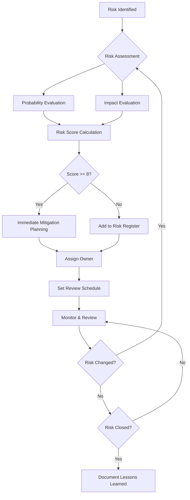

# Diana Bot V2 - Plan de Gestión de Riesgos

## 📋 Información del Documento

- **Producto**: Diana Bot V2
- **Versión**: 1.0
- **Fecha**: Agosto 2025
- **Basado en**: Implementation Plan v1.0, Technical Architecture v1.0
- **Audiencia**: Project Managers, Technical Leads, Stakeholders, Executive Team

---

## 🎯 Objetivos de Gestión de Riesgos

### Propósito
Identificar, evaluar, mitigar y monitorear proactivamente todos los riesgos que puedan impactar el éxito del proyecto Diana Bot V2, asegurando delivery exitoso dentro de tiempo, presupuesto y calidad esperada.

### Principios de Gestión de Riesgos
1. **Identificación Proactiva**: Anticipar riesgos antes de que se materialicen
2. **Evaluación Cuantitativa**: Usar datos y métricas para evaluar impacto
3. **Mitigación Temprana**: Actuar sobre riesgos de alto impacto inmediatamente
4. **Monitoreo Continuo**: Revisar y actualizar registro de riesgos regularmente
5. **Comunicación Transparente**: Mantener stakeholders informados sobre riesgos críticos
6. **Aprendizaje Organizacional**: Documentar lecciones aprendidas para futuros proyectos

### Success Criteria
- **Zero Surprise Failures**: No issues críticos que no hayan sido identificados previamente
- **Mitigation Effectiveness**: 90%+ de riesgos high/critical mitigados exitosamente
- **Recovery Time**: Issues críticos resueltos en <24 horas
- **Stakeholder Confidence**: Mantener >4.0/5 confidence rating durante todo el proyecto

---

## 📊 Framework de Evaluación de Riesgos

### Matriz de Probabilidad vs Impacto
```
IMPACTO →        Bajo      Medio      Alto      Crítico
PROBABILIDAD ↓    (1)       (2)        (3)        (4)
━━━━━━━━━━━━━━━━━━━━━━━━━━━━━━━━━━━━━━━━━━━━━━━━━━━━━━━━
Muy Alta (4)    │  4   │   8   │   12   │   16   │
                │ 🟡   │  🟠   │   🔴   │   🔴   │
━━━━━━━━━━━━━━━━━━━━━━━━━━━━━━━━━━━━━━━━━━━━━━━━━━━━━━━━
Alta (3)        │  3   │   6   │    9   │   12   │
                │ 🟢   │  🟡   │   🟠   │   🔴   │
━━━━━━━━━━━━━━━━━━━━━━━━━━━━━━━━━━━━━━━━━━━━━━━━━━━━━━━━
Media (2)       │  2   │   4   │    6   │    8   │
                │ 🟢   │  🟢   │   🟡   │   🟠   │
━━━━━━━━━━━━━━━━━━━━━━━━━━━━━━━━━━━━━━━━━━━━━━━━━━━━━━━━
Baja (1)        │  1   │   2   │    3   │    4   │
                │ 🟢   │  🟢   │   🟢   │   🟡   │
━━━━━━━━━━━━━━━━━━━━━━━━━━━━━━━━━━━━━━━━━━━━━━━━━━━━━━━━

🟢 Bajo (1-3): Monitor         🟡 Medio (4-6): Planificar mitigación
🟠 Alto (8-9): Mitigación activa   🔴 Crítico (12-16): Acción inmediata
```

### Categorías de Riesgos
```python
RISK_CATEGORIES = {
    "technical": "Riesgos relacionados con tecnología, arquitectura, y implementación",
    "schedule": "Riesgos que impactan timeline y deliverables",
    "resource": "Riesgos relacionados con team, budget, y capacity",
    "external": "Riesgos fuera del control directo del team",
    "business": "Riesgos que impactan objetivos de negocio",
    "security": "Riesgos de seguridad y compliance",
    "operational": "Riesgos de operación y mantenimiento"
}
```

---

## 🔴 Riesgos Críticos (Score 12-16)

### RISK-001: Diana Master System Complejidad Técnica
**Categoría**: Technical | **Probabilidad**: Alta (3) | **Impacto**: Crítico (4) | **Score**: 12

**Descripción**: La implementación del Diana Master System con AI adaptativo y generación dinámica de UI puede ser más compleja de lo estimado, resultando en delays significativos o compromise de funcionalidad.

**Indicadores de Riesgo**:
- Algoritmos de ML toman >2 semanas en converger
- Performance de AI inference >500ms
- Accuracy de mood detection <70%
- Integration complexity entre componentes AI

**Impacto Potencial**:
- **Timeline**: 4-6 semanas de delay
- **Scope**: Compromise de features de personalización avanzada
- **Quality**: UX menos fluida y personalizada
- **Budget**: $50K+ en recursos adicionales

**Estrategias de Mitigación**:

#### Mitigación Preventiva
- **Prototype Early**: Implementar core AI algorithms en Week 2-3
- **Incremental Complexity**: Empezar con reglas simples, evolucionar a ML
- **Performance Budget**: Establecer performance targets desde día 1
- **Expert Consultation**: Contratar AI/ML consultant por 2 semanas

#### Plan de Contingencia
- **Fallback Simple**: Sistema basado en reglas en lugar de ML
- **Reduced Scope**: Personalización básica en lugar de avanzada
- **External Service**: Integración con servicio ML externo (Google AutoML)
- **Timeline Adjustment**: Mover features avanzadas a Phase 2

**Acciones de Monitoreo**:
- Weekly ML model performance reviews
- Daily AI inference time monitoring
- User satisfaction surveys con personalization
- Technical debt tracking en AI components

**Owner**: AI/ML Engineer | **Review Date**: Weekly | **Status**: Active

---

### RISK-002: Telegram API Rate Limiting & Restrictions
**Categoría**: External | **Probabilidad**: Media (2) | **Impacto**: Crítico (4) | **Score**: 8

**Descripción**: Telegram puede imponer rate limits inesperados o cambiar sus APIs/policies, impactando funcionalidad core del bot o causando suspensión de cuenta.

**Indicadores de Riesgo**:
- Rate limiting warnings de Telegram
- API response time degradation
- Policy changes announced por Telegram
- Competitor bots being suspended

**Impacto Potencial**:
- **Service Disruption**: Bot completamente inoperativo
- **User Experience**: Responses lentos o fallidos
- **Business**: Loss de users y revenue durante downtime
- **Timeline**: Weeks para implementar workarounds

**Estrategias de Mitigación**:

#### Mitigación Preventiva
- **Rate Limit Management**: Implementar intelligent rate limiting desde día 1
- **Multi-Bot Strategy**: Prepare para usar múltiples bot tokens si necesario
- **API Monitoring**: Monitor real-time Telegram API health
- **Policy Compliance**: Review Telegram ToS y implement compliance checks

#### Plan de Contingencia
- **Alternative Channels**: Prepare integración con Discord/WhatsApp
- **Direct App**: MVP de mobile app como backup
- **Distributed Architecture**: Spread load across multiple accounts
- **Communication Plan**: Notify users via alternative channels

**Acciones de Monitoreo**:
- Real-time API rate limit monitoring
- Daily Telegram policy updates review
- Weekly competitor bot health checks
- Monthly compliance audit

**Owner**: Bot Specialist | **Review Date**: Daily | **Status**: Active

---

## 🟠 Riesgos Altos (Score 8-9)

### RISK-003: Team Knowledge Gap en AI/ML
**Categoría**: Resource | **Probabilidad**: Alta (3) | **Impacto**: Medio (2) | **Score**: 6

**Descripción**: El team puede no tener sufficient AI/ML expertise para implementar Diana Master System efectivamente, resultando en poor implementation o extended learning curve.

**Estrategias de Mitigación**:
- **Training Plan**: 2-week AI/ML bootcamp para team key members
- **External Expertise**: Contract AI consultant para primeras 4 semanas
- **Pair Programming**: AI engineer pairs con other developers
- **Knowledge Transfer**: Document all AI decisions y implementations

**Owner**: Tech Lead | **Review Date**: Bi-weekly | **Status**: Active

---

### RISK-004: Database Performance Under Load
**Categoría**: Technical | **Probabilidad**: Media (2) | **Impacto**: Alto (3) | **Score**: 6

**Descripción**: Database puede no handle expected user load, especialmente para real-time features como leaderboards y notifications.

**Estrategias de Mitigación**:
- **Early Load Testing**: Start load testing en Week 4
- **Database Optimization**: Query optimization y proper indexing
- **Caching Strategy**: Redis caching para high-frequency data
- **Scaling Plan**: Database horizontal scaling preparation

**Owner**: Backend Developer | **Review Date**: Weekly | **Status**: Active

---

### RISK-005: Scope Creep from Stakeholders
**Categoría**: Business | **Probabilidad**: Alta (3) | **Impacto**: Medio (2) | **Score**: 6

**Descripción**: Stakeholders pueden request additional features o changes durante development, impacting timeline y budget.

**Estrategias de Mitigación**:
- **Change Control Process**: Formal process para scope changes
- **MVP Definition**: Clear MVP boundaries communicated
- **Regular Reviews**: Weekly stakeholder demos y feedback sessions
- **Impact Analysis**: Quantify impact de any requested changes

**Owner**: Project Manager | **Review Date**: Weekly | **Status**: Active

---

## 🟡 Riesgos Medios (Score 4-6)

### RISK-006: Payment Gateway Integration Issues
**Categoría**: External | **Probabilidad**: Media (2) | **Impacto**: Medio (2) | **Score**: 4

**Descripción**: Integration con Stripe/PayPal puede ser más complex than expected, delaying monetization features.

**Estrategias de Mitigación**:
- **Early Integration**: Start payment integration en Week 15 (not Week 17)
- **Multiple Options**: Prepare both Stripe y PayPal integrations
- **Sandbox Testing**: Extensive testing en sandbox environments
- **Documentation Review**: Thorough API documentation review

**Owner**: Backend Developer | **Review Date**: Bi-weekly | **Status**: Planned

---

### RISK-007: User Adoption Lower Than Expected
**Categoría**: Business | **Probabilidad**: Media (2) | **Impacto**: Medio (2) | **Score**: 4

**Descripción**: Users may not adopt the bot as expected, impacting business goals y ROI.

**Estrategias de Mitigación**:
- **User Research**: Conduct user interviews durante development
- **Beta Testing**: Extensive beta testing con target users
- **Marketing Preparation**: Marketing campaign preparation durante development
- **Feedback Loop**: Quick iteration based en user feedback

**Owner**: Product Manager | **Review Date**: Monthly | **Status**: Planned

---

### RISK-008: Third-Party Service Dependencies
**Categoría**: External | **Probabilidad**: Media (2) | **Impacto**: Medio (2) | **Score**: 4

**Descripción**: Dependencies en external services (AWS, Redis, monitoring tools) pueden cause disruptions.

**Estrategias de Mitigación**:
- **Multi-Region Setup**: Deploy across multiple AWS regions
- **Service Alternatives**: Identify backup options para critical services
- **Health Monitoring**: Comprehensive health monitoring setup
- **SLA Reviews**: Review y understand SLAs de all external services

**Owner**: DevOps Engineer | **Review Date**: Monthly | **Status**: Active

---

## 🟢 Riesgos Bajos (Score 1-3)

### RISK-009: Team Member Unavailability
**Categoría**: Resource | **Probabilidad**: Baja (1) | **Impacto**: Medio (2) | **Score**: 2

**Estrategias de Mitigación**:
- **Cross-Training**: Ensure knowledge sharing across team members
- **Documentation**: Comprehensive technical documentation
- **Backup Resources**: Identify contractor options

**Owner**: Project Manager | **Review Date**: Monthly | **Status**: Monitor

---

### RISK-010: Competitive Product Launch
**Categoría**: Business | **Probabilidad**: Media (2) | **Impacto**: Bajo (1) | **Score**: 2

**Estrategias de Mitigación**:
- **Market Monitoring**: Regular competitive analysis
- **Differentiation Focus**: Emphasize unique value propositions
- **Speed to Market**: Maintain aggressive timeline

**Owner**: Product Manager | **Review Date**: Monthly | **Status**: Monitor

---

## 📈 Plan de Monitoreo y Control

### Risk Review Schedule
```python
RISK_REVIEW_SCHEDULE = {
    "daily_risk_check": {
        "frequency": "Daily",
        "duration": "15 minutes",
        "participants": ["Tech Lead", "Project Manager"],
        "focus": ["Critical risks", "New risks", "Escalations"]
    },

    "weekly_risk_review": {
        "frequency": "Weekly",
        "duration": "1 hour",
        "participants": ["Full Team"],
        "focus": ["All active risks", "Mitigation progress", "New risk identification"]
    },

    "monthly_risk_board": {
        "frequency": "Monthly",
        "duration": "2 hours",
        "participants": ["Team + Stakeholders"],
        "focus": ["Strategic risks", "Portfolio view", "Resource allocation"]
    }
}
```

### Risk Metrics & KPIs
```python
RISK_METRICS = {
    "risk_identification_rate": {
        "target": "2+ new risks identified per week",
        "purpose": "Ensure proactive risk identification"
    },

    "mitigation_success_rate": {
        "target": "90%+ of high/critical risks successfully mitigated",
        "purpose": "Measure effectiveness of mitigation strategies"
    },

    "risk_impact_realization": {
        "target": "<10% of identified risks materialize with full impact",
        "purpose": "Validate risk assessment accuracy"
    },

    "surprise_incident_rate": {
        "target": "Zero incidents not previously identified as risks",
        "purpose": "Measure comprehensiveness of risk identification"
    }
}
```

### Risk Communication Plan
```python
RISK_COMMUNICATION = {
    "risk_status_dashboard": {
        "audience": "Team + Stakeholders",
        "update_frequency": "Real-time",
        "content": ["Risk heat map", "Top 5 risks", "Mitigation status"]
    },

    "weekly_risk_report": {
        "audience": "Stakeholders",
        "format": "Email summary",
        "content": ["New risks", "Status changes", "Escalations needed"]
    },

    "critical_risk_alert": {
        "audience": "Executive Team",
        "trigger": "Score 12+ risk identified or materialized",
        "response_time": "Within 2 hours"
    }
}
```

---

## 🚨 Incident Response Plan

### Incident Classification
```python
INCIDENT_LEVELS = {
    "P0_critical": {
        "definition": "Complete service outage or security breach",
        "response_time": "Immediate (15 minutes)",
        "team": "Full team + management",
        "communication": "Hourly updates to all stakeholders"
    },

    "P1_high": {
        "definition": "Major functionality broken, impacting >50% users",
        "response_time": "1 hour",
        "team": "Core technical team",
        "communication": "Every 4 hours to stakeholders"
    },

    "P2_medium": {
        "definition": "Minor functionality issues, workaround available",
        "response_time": "4 hours",
        "team": "Relevant specialists",
        "communication": "Daily updates"
    },

    "P3_low": {
        "definition": "Cosmetic issues, no functional impact",
        "response_time": "Next business day",
        "team": "Individual contributor",
        "communication": "Weekly summary"
    }
}
```

### Crisis Communication Templates

#### Critical Risk Materialized - Stakeholder Notification
```
Subject: [URGENT] Diana Bot V2 - Critical Risk Materialized

Dear Stakeholders,

A critical risk has materialized that requires immediate attention:

Risk ID: [RISK-XXX]
Impact: [Specific impact description]
Current Status: [What's happening now]
Immediate Actions: [What we're doing right now]
Expected Resolution: [Timeline estimate]

Next Update: [When next update will be sent]

Contact: [Emergency contact information]

[Name], Project Manager
```

#### Risk Status Change - Team Notification
```
Team,

Risk Status Update:

Risk: [Risk description]
Previous Status: [Old status]
New Status: [New status]
Reason for Change: [Why status changed]
Action Required: [What team needs to do]

Details: [Additional context]

Please acknowledge receipt of this update.

[Name], Tech Lead
```

---

## 📚 Risk Knowledge Base

### Lessons Learned Repository
```python
LESSONS_LEARNED = {
    "ai_ml_implementation": {
        "lesson": "Start with simple rule-based systems before ML",
        "context": "Complex ML systems require significant tuning time",
        "recommendation": "Implement basic functionality first, enhance with ML later"
    },

    "telegram_api_integration": {
        "lesson": "Rate limiting is stricter than documented",
        "context": "Production rate limits differ from sandbox",
        "recommendation": "Test with production-level traffic early"
    },

    "team_scaling": {
        "lesson": "Knowledge transfer takes longer than expected",
        "context": "New team members need 2-3 weeks to become productive",
        "recommendation": "Plan for extended onboarding time"
    }
}
```

### Risk Pattern Library
```python
RISK_PATTERNS = {
    "external_api_dependency": {
        "pattern": "External API changes or becomes unavailable",
        "common_triggers": ["API version updates", "Service provider changes", "Rate limiting"],
        "standard_mitigations": ["Wrapper abstractions", "Multiple providers", "Graceful degradation"]
    },

    "performance_degradation": {
        "pattern": "System performance degrades under load",
        "common_triggers": ["User growth", "Data volume increase", "Feature complexity"],
        "standard_mitigations": ["Load testing", "Performance monitoring", "Caching layers"]
    },

    "scope_creep": {
        "pattern": "Project scope expands beyond original plan",
        "common_triggers": ["Stakeholder requests", "Market changes", "Competitive pressure"],
        "standard_mitigations": ["Change control", "Impact analysis", "Stakeholder education"]
    }
}
```

---

## 🔄 Risk Management Process

### Risk Identification Process


### Weekly Risk Review Agenda
```python
WEEKLY_RISK_REVIEW_AGENDA = {
    "1_risk_register_review": {
        "duration": "15 minutes",
        "activity": "Review all active risks for status changes"
    },

    "2_new_risk_identification": {
        "duration": "15 minutes",
        "activity": "Brainstorm new risks based on weekly progress"
    },

    "3_mitigation_progress": {
        "duration": "20 minutes",
        "activity": "Review mitigation action progress and effectiveness"
    },

    "4_escalation_decisions": {
        "duration": "10 minutes",
        "activity": "Decide on risks that need escalation to stakeholders"
    }
}
```

---

## 📊 Risk Reporting Templates

### Executive Risk Summary
```markdown
# Diana Bot V2 - Executive Risk Summary
**Date**: [Date]
**Overall Risk Status**: 🟡 MEDIUM

## Top 3 Risks Requiring Attention

### 1. [Risk Name] - Score: [X]
- **Impact**: [Brief impact description]
- **Mitigation**: [Key mitigation actions]
- **Owner**: [Name]
- **Target Resolution**: [Date]

### 2. [Risk Name] - Score: [X]
- **Impact**: [Brief impact description]  
- **Mitigation**: [Key mitigation actions]
- **Owner**: [Name]
- **Target Resolution**: [Date]

### 3. [Risk Name] - Score: [X]
- **Impact**: [Brief impact description]
- **Mitigation**: [Key mitigation actions]
- **Owner**: [Name]
- **Target Resolution**: [Date]

## Risk Trend
- **New Risks This Week**: [Number]
- **Risks Closed**: [Number]
- **Risks Escalated**: [Number]

## Resource Needs
[Any additional resources needed for risk mitigation]

## Recommendation
[Executive recommendation/decision needed]
```

### Technical Risk Detail Report
```markdown
# Technical Risk Analysis - [Risk ID]

## Risk Description
[Detailed technical description]

## Technical Impact Analysis
- **Performance Impact**: [Specific metrics]
- **Security Impact**: [Security implications]
- **Maintainability Impact**: [Long-term code impact]
- **Integration Impact**: [Effect on other systems]

## Technical Mitigation Options
1. **Option A**: [Description, effort, pros/cons]
2. **Option B**: [Description, effort, pros/cons]
3. **Option C**: [Description, effort, pros/cons]

## Recommended Approach
[Technical team recommendation with justification]

## Implementation Plan
[Step-by-step implementation plan]

## Success Criteria
[How to measure mitigation success]
```

---

**Plan de Riesgos Vivo**: Este plan será actualizado semanalmente con new risks identified, status changes de existing risks, y lessons learned from materialized risks.

**Próxima Revisión**: Weekly risk review meetings y monthly comprehensive risk assessment.
