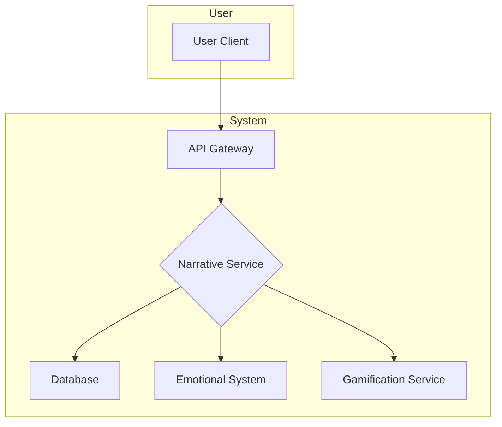

# Narrative Service - Architecture Design

## 1. System Architecture

The Narrative Service will be implemented as a self-contained microservice. This approach decouples the narrative logic from other core services (like user management or gamification), improving maintainability, scalability, and resilience.

### Key Components:

*   **API Gateway:** A single entry point for all incoming requests. It will handle authentication and route requests to the Narrative Service.
*   **Narrative Service Core:** The main application containing the business logic for managing narrative progression. It will be a stateless service to allow for horizontal scaling.
*   **Database:** A dedicated PostgreSQL database to store all narrative-related data, including story content and user progress.
*   **Service Integrations:** The service will communicate with other internal services via a dedicated event bus or direct API calls for real-time interactions.

### High-Level Diagram:



## 2. Data Model

The database schema is designed to be strictly multi-tenant, with `tenant_id` present in all tables that store user-specific data.

### Table: `narrative_content`

Stores the static content of the story. This table is not tenanted as the story is the same for all users.

| Column Name | Data Type | Description |
| :--- | :--- | :--- |
| `id` | `UUID` | Primary Key |
| `node_id` | `VARCHAR(255)` | A unique identifier for a story node (e.g., "CHAPTER_1_START"). |
| `node_type` | `VARCHAR(50)` | Type of node (e.g., 'SCENE', 'CHOICE'). |
| `content` | `JSONB` | The text content, character voice (Lucien/Diana), etc. |
| `parent_id` | `UUID` | Foreign key to `narrative_content` for branching. |
| `created_at` | `TIMESTAMP` | |

### Table: `user_narrative_progress`

Tracks the current position of each user in the narrative.

| Column Name | Data Type | Description |
| :--- | :--- | :--- |
| `id` | `UUID` | Primary Key |
| `user_id` | `VARCHAR(255)` | The user's unique identifier. |
| `tenant_id` | `VARCHAR(255)` | The identifier for the bot instance. **(Indexed)** |
| `current_node_id` | `UUID` | Foreign key to `narrative_content.id`. |
| `updated_at` | `TIMESTAMP` | |

**Composite Index:** `(user_id, tenant_id)` for fast lookups.

### Table: `user_choices`

Logs every decision a user makes for future consequence branching.

| Column Name | Data Type | Description |
| :--- | :--- | :--- |
| `id` | `UUID` | Primary Key |
| `user_id` | `VARCHAR(255)` | The user's unique identifier. |
| `tenant_id` | `VARCHAR(255)` | The identifier for the bot instance. |
| `node_id` | `UUID` | The story node where the choice was made. |
| `choice_made` | `JSONB` | The specific choice selected by the user. |
| `created_at` | `TIMESTAMP` | |

## 3. API Design

The API will be exposed via the central API Gateway. All endpoints require a `user_id` and `tenant_id` to be passed in the request headers or JWT payload for authentication and data scoping.

### `GET /narrative/state`

Fetches the user's current narrative state, including the scene description and available choices.

*   **Request:**
    *   Headers: `X-User-ID`, `X-Tenant-ID`
*   **Success Response (200 OK):**
    ```json
    {
      "node_id": "CHAPTER_1_CHOICE_1",
      "character": "Lucien",
      "text": "Before you are two paths. One leads to the city, bathed in light; the other, to the forest, shrouded in shadow. You must choose.",
      "choices": [
        {
          "choice_id": "GOTO_CITY",
          "text": "Walk towards the city."
        },
        {
          "choice_id": "GOTO_FOREST",
          "text": "Enter the forest."
        }
      ]
    }
    ```

### `POST /narrative/choice`

Submits a user's decision for a given choice node.

*   **Request:**
    *   Headers: `X-User-ID`, `X-Tenant-ID`
    *   Body:
        ```json
        {
          "node_id": "CHAPTER_1_CHOICE_1",
          "choice_id": "GOTO_FOREST"
        }
        ```
*   **Success Response (200 OK):**
    *   Returns the new narrative state (the result of the choice), following the same format as `GET /narrative/state`. This saves the client from making a second call.

## 4. Technology Recommendations

*   **Language/Framework:** **Python** with **FastAPI**.
    *   **Justification:** FastAPI is a modern, high-performance web framework that is excellent for building microservices. Python has a mature ecosystem for database interaction and service communication.
*   **Database:** **PostgreSQL**.
    *   **Justification:** It is a robust, open-source relational database with excellent support for `JSONB`, which is ideal for storing flexible narrative content. Its reliability and strong performance are well-suited for this service.
*   **Deployment:** **Docker/Kubernetes**.
    *   **Justification:** Containerizing the service with Docker will ensure consistency across environments. Deploying on Kubernetes will provide scalability, resilience, and automated management.

## 5. Architectural Peer Review

### Scalability
*   **Assessment:** The stateless nature of the service core is a significant strength, allowing for easy horizontal scaling behind a load balancer.
*   **Potential Bottleneck:** The database is the most likely bottleneck under high load. While the proposed indexing on `(user_id, tenant_id)` is correct for user-specific lookups, the `narrative_content` table could become a read-heavy hotspot.
*   **Recommendation:** Implement a caching layer (e.g., Redis) for the `narrative_content` table. Since this content is largely static, it's a prime candidate for caching, which would significantly reduce read load on the primary database.

### Security
*   **Assessment:** The multi-tenancy model, enforced by a `tenant_id` in all relevant tables and API calls, is a solid foundation for data isolation.
*   **Potential Weakness:** The current design relies on the API Gateway and the service itself to enforce tenancy checks. A bug in the code could potentially lead to data leakage between tenants.
*   **Recommendation:** While the current approach is standard, for higher security environments, consider implementing Row-Level Security (RLS) in PostgreSQL. This would enforce data isolation at the database level, providing an additional layer of defense. For now, the application-level enforcement is sufficient but RLS should be kept in mind for future hardening.

### Maintainability
*   **Assessment:** The microservice approach is excellent for maintainability. The separation of concerns is clear.
*   **Potential Improvement:** The `content` field in `narrative_content` is a `JSONB` blob. While flexible, this could become hard to manage if the structure of the narrative content becomes very complex.
*   **Recommendation:** Enforce a strict schema for the `JSONB` content at the application level (e.g., using Pydantic models in FastAPI) to ensure consistency. The structure of this JSON object should be formally documented.

### Key Trade-offs
*   **PostgreSQL vs. NoSQL:** A NoSQL database (like MongoDB) was considered for its flexibility in storing narrative content. However, PostgreSQL was chosen because its relational capabilities are superior for managing user progress and choices, which have clear relationships. The use of `JSONB` provides a good balance of flexibility and relational integrity.
*   **Monolith vs. Microservice:** A monolithic approach would have been faster to develop initially. However, the microservice architecture was chosen for long-term scalability and maintainability, which is a critical consideration for the Diana Bot ecosystem.
*   **Event Bus vs. Direct API Calls:** The design allows for both. Direct calls are simpler for synchronous actions (like fetching the current state). An event bus would be better for asynchronous actions (like notifying the Gamification Service of a milestone). The recommendation is to use direct, synchronous calls for the core narrative flow and introduce an event bus for non-critical, asynchronous side-effects.
